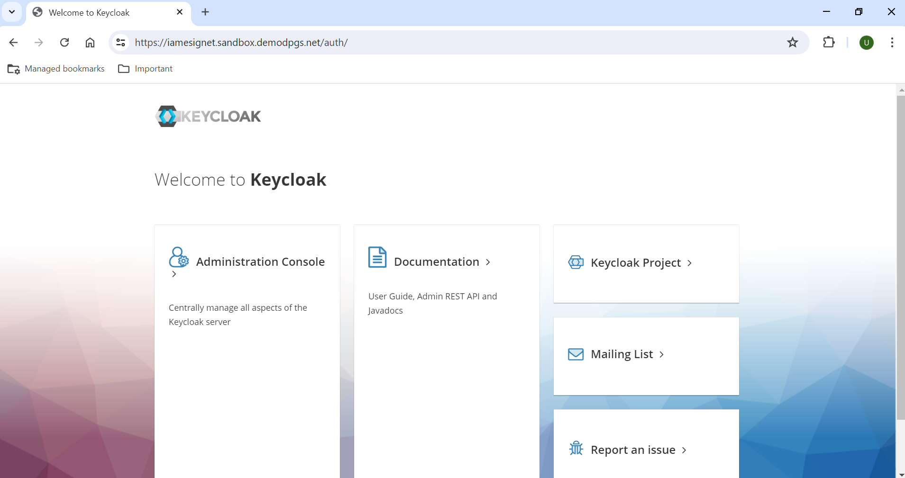

# Post Installation Steps

Please verify that the URLs and settings align with your specific deployment and requirements. Enjoy leveraging eSignet for your project and begin utilizing both the eSignet UI and API.

- Keycloak portal will be accessible at **https://<KEYCLOAK_DOMAIN_NAME>/auth**

- eSignet API portal will be accessible at **https://<ESIGNET_DOMAIN>/v1/esignet/swagger-ui.html**

- eSignet UI portal will be accessible at **https://<ESIGNET_DOMAIN>/**

With this, the deployment of eSignet on AWS has been successfully completed.

# eSignet Integration with relying party:
This README provides instructions for configuring esignet with relying party to verify the esignet flow. In order to use eSignet service, you need to create OIDC client. OIDC client creates the client id, public & private key pair for the relying party app to use eSignet. The relying party application can be any web application which uses eSignet as one of the authentication method.

## Create OIDC client

Follow the below steps to create OIDC client in postman.

3. Download the postman script from [here](https://github.com/mosip/esignet/blob/v1.3.0/docs/postman-collections/esignet-with-mock-IDA.postman_collection.json)
and its environment from [here](https://github.com/mosip/esignet/blob/v1.3.0/docs/postman-collections/esignet-with-mock-IDA.postman_environment.json)

4. Import the downloaded collection and environment into postman.

5. To create an OIDC/OAuth client, run the below request from the postman collection "OIDC Client mgmt" folder
   * Get CSRF token
   * Create OIDC Client

6. To Create a Mock identity, run the below request from the postman collection "Mock-Identity-System" folder
   * Create Mock Identity

7. To run the OIDC flow with mock identity run the below request(same order) from the postman collection "AuthCode flow with OTP login" folder.
   * Get CSRF token
   * Authorize / OAuthdetails request
   * Send OTP
   * Authenticate User
   * Authorization Code
   * Get Tokens
   * Get userInfo

## Integration with Relying party
After configuring eSignet, visit the URL below to deploy the relying party app for integration and to verify eSignet authentication.

[Relying-Party-Integration](https://github.com/mosip/esignet-mock-services/tree/v0.9.3)
